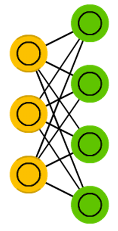

# Probabilistic Graphical Models

## Markov Chains

### Background

*Markov chains (MC or discrete time Markov Chain, DTMC)* are kind of the
predecessors to BMs and HNs. They can be understood as follows: from
this node where I am now, what are the odds of me going to any of my
neighbouring nodes? They are memoryless (i.e. Markov Property) which
means that every state you end up in depends completely on the previous
state. While not really a neural network, they do resemble neural
networks and form the theoretical basis for BMs and HNs. MC aren’t
always considered neural networks, as goes for BMs, RBMs and HNs. Markov
chains aren’t always fully connected either.

*Hayes, Brian. “First links in the Markov chain.” American Scientist 101.2
(2013): 252.* [https://www.americanscientist.org/article/first-links-in-the-markov-chain]
(https://www.americanscientist.org/article/first-links-in-the-markov-chain).

### Use Cases

#### PageRank

<<WRK/PageRankInPythonUsingMarkovChains.md>>

#### MCMC - Markov Chain Monte Carlo

### Example

## Hopfield Networks

A *Hopfield network (HN)* is a network where every neuron is connected
to every other neuron; it is a completely entangled plate of spaghetti
as even all the nodes function as everything. Each node is input before
training, then hidden during training and output afterwards. The
networks are trained by setting the value of the neurons to the desired
pattern after which the weights can be computed. The weights do not
change after this. Once trained for one or more patterns, the network
will always converge to one of the learned patterns because the network
is only stable in those states. Note that it does not always conform to
the desired state (it’s not a magic black box sadly). It stabilises in
part due to the total “energy” or “temperature” of the network being
reduced incrementally during training. Each neuron has an activation
threshold which scales to this temperature, which if surpassed by
summing the input causes the neuron to take the form of one of two
states (usually -1 or 1, sometimes 0 or 1). Updating the network can be
done synchronously or more commonly one by one. If updated one by one, a
fair random sequence is created to organise which cells update in what
order (fair random being all options (n) occurring exactly once every n
items). This is so you can tell when the network is stable (done
converging), once every cell has been updated and none of them changed,
the network is stable (annealed). These networks are often called
associative memory because the converge to the most similar state as the
input; if humans see half a table we can image the other half, this
network will converge to a table if presented with half noise and half a
table.

*Hopfield, John J. “Neural networks and physical systems with emergent
collective computational abilities.” Proceedings of the national academy
of sciences 79.8 (1982): 2554-2558.*
[https://bi.snu.ac.kr/Courses/g-ai09-2/hopfield82.pdf]
(https://bi.snu.ac.kr/Courses/g-ai09-2/hopfield82.pdf)

## Boltzmann Machines

*Boltzmann machines (BM)* are a lot like HNs, but: some neurons are
marked as input neurons and others remain “hidden”. The input neurons
become output neurons at the end of a full network update. It starts
with random weights and learns through back-propagation, or more
recently through contrastive divergence (a Markov chain is used to
determine the gradients between two informational gains). Compared to a
HN, the neurons mostly have binary activation patterns. As hinted by
being trained by MCs, BMs are stochastic networks. The training and
running process of a BM is fairly similar to a HN: one sets the input
neurons to certain clamped values after which the network is set free
(it doesn’t get a sock). While free the cells can get any value and we
repetitively go back and forth between the input and hidden neurons. The
activation is controlled by a global temperature value, which if lowered
lowers the energy of the cells. This lower energy causes their
activation patterns to stabilise. The network reaches an equilibrium
given the right temperature.

*Hinton, Geoffrey E., and Terrence J. Sejnowski. “Learning and releaming in
Boltzmann machines.” Parallel distributed processing: Explorations in the
microstructure of cognition 1 (1986): 282-317.*
[https://www.researchgate.net/profile/Terrence_Sejnowski/publication/242509302_Learning_and_relearning_in_Boltzmann_machines/links/54a4b00f0cf256bf8bb327cc.pdf]
(https://www.researchgate.net/profile/Terrence_Sejnowski/publication/242509302_Learning_and_relearning_in_Boltzmann_machines/links/54a4b00f0cf256bf8bb327cc.pdf)

## Restricted Boltzmann Machines

------------------------------------------------------------------------

*Restricted Boltzmann machines (RBM)* are remarkably similar to BMs
(surprise) and therefore also similar to HNs. The biggest difference
between BMs and RBMs is that RBMs are a better usable because they are
more restricted. They don’t trigger-happily connect every neuron to
every other neuron but only connect every different group of neurons to
every other group, so no input neurons are directly connected to other
input neurons and no hidden to hidden connections are made either. RBMs
can be trained like FFNNs with a twist: instead of passing data forward
and then back-propagating, you forward pass the data and then backward
pass the data (back to the first layer). After that you train with
forward-and-back-propagation.

*Smolensky, Paul. Information processing in dynamical systems:
Foundations of harmony theory. No. CU-CS-321-86. COLORADO UNIV AT
BOULDER DEPT OF COMPUTER SCIENCE, 1986.*
[http://www.dtic.mil/cgi-bin/GetTRDoc?Location=U2&doc=GetTRDoc.pdf&AD=ADA620727]
(http://www.dtic.mil/cgi-bin/GetTRDoc?Location=U2&doc=GetTRDoc.pdf&AD=ADA620727)

